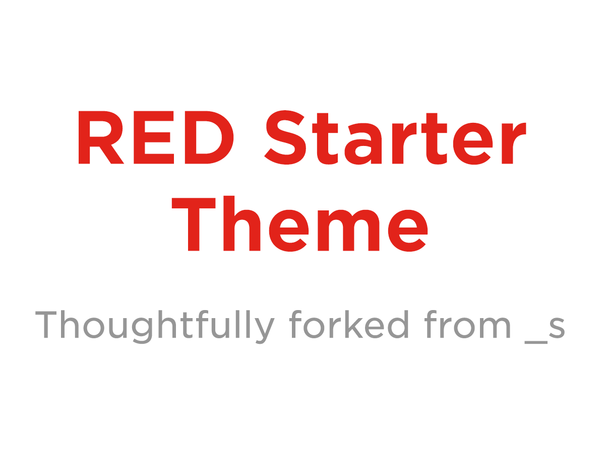

**What I learned:**

###Personal Learnings
Being the first time I have used Wordpress, it was very difficult to learn all the Wordpress functions used for PHP and to understand how to use them accordingly. After trying to figure them out with trial and error, I was then able to understand why Wordpress is such an important and powerful tool. It is simply laided out and easy to work with. It allows the client to obtain much control over the site where if they ever need to modify any of their information ie. there business hours, they are able to do so easily. The Wordpress documentation makes it easy and simple to use. The options of built-in functions that is provides, makes it both easy and simple to do so. In addition, though in the beginning this project seemed very difficult and over my head to complete. Once getting started and becoming familiar with the functions made is easier to understand. Though I was not able to fully complete this project, I feel that with a little more time I would have been able to successfully complete and meet all the requirements. It was an exciting challenge to execute Javascript functionality into this project, alongside the CSS requirements that came along with it. But once the page slowly started coming together, it was very exciting to see everything coming together. Inhabinet was the fourth project I have completed while being at RED, which allowed me to utilize both my HTML and CSS skills that I have obtained so far in this program.

**Technologies used in this project:**
* Sass
* HTML5
* CSS
*  Wordpress
*  PHP
*  Javascript
*  Es6 
* Es2015
*  Google maps 
* SVG MAMP
*  Akismet Anti-Spam
* Custom Field Suite
* Debug Bar
* Inhabitent Blocks
* Query Monitor
* Theme Check
* GITHUB
* Created a custom Post-type for the Products in a seperate functionality plug-in.
* Created a custom Taxonomy for Product Type in a seperate functionality plug -n.
* Used Custom Field Suite plug in to change the input through WordPress dashboard.
* Created a custom widget plug-in to allow dynamic change of the business hours in the sidebar.
* Toggle search bar in the header designed with Javascript and CSS animation.

**Contributors:**
Saveen Toor

###Screenshot

